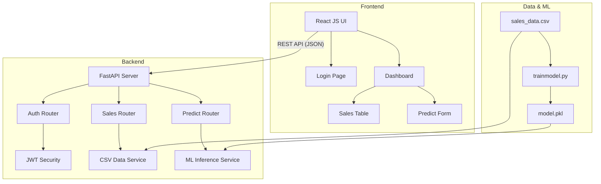

# Mini AI Sales Prediction - Project Dashboard

Sistem ini dikembangkan untuk mengelola data penjualan, menampilkan dashboard analitik sederhana, dan melakukan prediksi status produk (**Laris / Tidak Laris**) menggunakan model Machine Learning terintegrasi.

## 🚀 Fitur Utama
- **Autentikasi JWT**: Sistem login aman menggunakan token JWT.
- **Dashboard Penjualan**: Tabel interaktif untuk memonitor data stok dan penjualan.
- **Prediksi Machine Learning**: Form cerdas untuk memprediksi potensi penjualan produk baru.
- **Responsive UI**: Tampilan yang menyesuaikan dengan perangkat pengguna (Desktop/Mobile).

---

## 🏗️ Arsitektur Sistem



### Penjelasan Alur Data:
1. **Login**: User memasukkan kredensial admin. Backend memverifikasi dan mengembalikan JWT Token.
2. **Fetch Data**: Frontend mengirim request GET ke `/sales` dengan header authorization. Backend membaca `sales_data.csv` dan mengirimkan data JSON.
3. **Prediksi**: User mengisi form (Jumlah, Harga, Diskon). Frontend mengirim data POST ke `/predict`. Backend memanggil model `DecisionTreeClassifier` yang sudah di-load untuk memproses input dan mengembalikan status (Laris/Tidak Laris).

---

## 🛠️ Tech Stack
- **Frontend**: React JS, Vite, Lucide Icons.
- **Backend**: Python, FastAPI, Uvicorn, Jose (JWT).
- **Machine Learning**: Scikit-Learn (Decision Tree), Pandas, NumPy, Joblib.

---

## 📂 Struktur Proyek
```text
project-root/
├── backend/            # FastAPI Implementation
│   ├── app/
│   │   ├── core/       # Security & JWT logic
│   │   ├── models/     # Pydantic schemas
│   │   ├── services/   # Business & ML logic
│   │   └── routers/    # API Endpoints
│   └── run.py          # Entry point backend
├── frontend/           # React Application
├── data/               # Raw Dataset (CSV)
├── ml/                 # ML Script & Model Artifacts
└── README.md
```

---

## 💻 Cara Menjalankan Project

### 1. Persiapan Backend
```bash
cd backend
# Install dependencies
pip install -r requirements.txt
# Run the server
python run.py
```
*API akan berjalan di http://localhost:8000 dan dokumentasi Swagger tersedia di http://localhost:8000/docs*

### 2. Persiapan Frontend
```bash
cd frontend
# Install dependencies
npm install
# Run the dev server
npm run dev
```
*Akses aplikasi di http://localhost:5173*

### 3. Training Model (Opsional)
Jika ingin melatih ulang model:
```bash
python ml/trainmodel.py
```

---

## 📝 Design Decisions & Asumsi
1. **Model ML**: Menggunakan `DecisionTreeClassifier` karena kemampuannya menangani fitur kategorikal/numerik secara efisien untuk klasifikasi biner dan mudah diinterpretasikan.
2. **Asumsi Data**: User diasumsikan login sebagai admin (username: `admin`, password: `admin`).
3. **Keamanan**: JWT digunakan untuk membatasi akses endpoint API (Meskipun di demo ini diimplementasikan secara sederhana).
4. **Data Persistence**: Menggunakan CSV sebagai database sederhana untuk memenuhi kriteria scope pekerjaan tanpa memerlukan setup database SQL yang kompleks.

---

## 📸 Screenshots
*(Tersedia di folder /screenshoots)*
1. Login Page
2. Dashboard (Table & Predict Form)